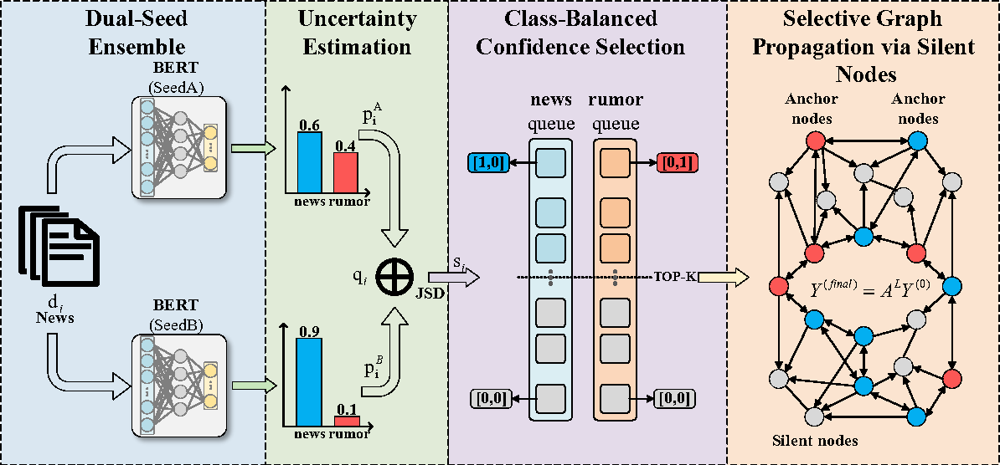

# SPADE: Selective Propagation via Anchor-based Dual-seed Ensemble

[]()
[]()

> This repository contains the code and processed datasets for the anonymous EMNLP submission introducing the **SPADE** framework.

## 🛠️ Framework Overview

<p align="center">
  
</p>

> **The SPADE Architecture:** Our framework introduces an anchor-based selection mechanism to identify reliable seed nodes, followed by a selective propagation strategy to mitigate noise and confirmation bias in few-shot fake news detection.

## 📂 Project Structure
After extracting data.zip into the root directory, your workspace should be organized as follows. The framework expects this specific structure to locate processed graphs and reference logs.
```text
SPADE/
├── logs/
├   └── logs_our/               # Full 20-trial execution logs for SPADE
├── Process/
│   ├── lm_loadsplits.py        # Data splitting and processing scripts
│   └── adj_matrix_fewshot.py   # Script to construct adjacency matrices from raw social context
├── data/                       # Extracted from data.zip
│   ├── adjs/                   # Pre-processed adjacency matrices (news proximity graphs)
│   ├── news_articles_raw/      # Collected news texts and metadata
│   ├── social_context_raw/     # Processed user-news interaction records
│   ├── fang_test.csv           # Test set containing news articles and ground-truth labels
│   └── ...                     # Other dataset splits (e.g., politifact, gossipcop)
├── SPADE.py                    # Main training and evaluation script
├── run.sh                      # Shell script to reproduce experiments
├── requirements.txt            # Core dependencies
└── README.md
```

## ⚙️ Environment Setup
The code has been tested with Python 3.7 and PyTorch 1.8.0 (CUDA 11.1). Experiments can be run on a single NVIDIA GPU with at least 12GB of memory.

1. Create and activate a clean environment:

```bash
conda create -n spade python=3.7
conda activate spade
```
2. Install PyTorch compatible with CUDA 11.1:

```bash
pip install torch==1.8.0 torchvision==0.9.0 torchaudio==0.8.0 -f https://download.pytorch.org/whl/cu111/torch_stable.html
```
3. Install dependencies:

```bash
pip install -r requirements.txt
```
*(Note: The pre-trained bert-base-uncased weights will be automatically downloaded during the first run.)*

## 📥 Data Preparation
The preprocessed graph datasets (adjacency matrices and few-shot splits) are provided in `data.zip`. 

1. **Setup**: Download and extract [`data.zip`](./data.zip) to the root directory.
2. **Dataset Contents**: 
   * **News Articles**: `.csv` files containing article text and ground-truth labels (`0`: Real, `1`: Fake).
   * **Social Context**: Pre-processed `.pkl` files (located in `data/adjs/`) containing the normalized adjacency matrices $\mathbf{A}_{\mathcal{T}}$ constructed from user engagement records.
   * **Raw Interaction Data**: We provide the raw user-news engagement records (`social_context_raw/`) and metadata (`news_articles_raw/`) used to construct the graphs for full transparency.

3. **Constructing Adjacency Matrices from Scratch**:
As an alternative to using our pre-processed matrices, you can reproduce the news proximity graphs from the raw social context (filtering for active users with $\ge 5$ reposts) by running:
```bash
# This script processes raw user interactions into normalized adjacency matrices
python Process/adj_matrix_fewshot.py
```

## 🚀 Running Experiments
To reproduce the main results reported in the paper, execute the provided bash script.

```bash
bash run.sh
```
Alternatively, you can run the Python script manually with customized parameters:

```bash
python SPADE.py --dataset_name politifact --n_samples 16 --u_thres 5 --n_epochs 3 --iters 20
```
**Parameter Descriptions:**
* `--n_samples`: Number of training samples per class in $k$-shot setting.
* `--u_thres`: Threshold $t_u$ for filtering active social users.
* `--iters`: Number of independent trials for statistical stability.
* `--n_epochs`: Training epochs for each trial.

To reproduce the statistical significance results (T-test) reported below:
```bash
python stat_test.py
```

## 📊 Experimental Results & Statistical Significance
As specified in **Appendix A** of our paper, all results are computed across **20 independent trials** to ensure statistical robustness. 

While the main paper focuses on comparative performance across baselines to maintain a focused and concise narrative, we provide the full statistical distribution here to facilitate deeper reproduction analysis and absolute data transparency. The values below denote the **Sample Mean** and the **Unbiased Sample Standard Deviation** ($s$, calculated with **Bessel's Correction**, $ddof=1$).

| Dataset | Setting | Accuracy (Mean ± Std) | Precision (Macro) | Recall (Macro) | F1-Macro |
| :--- | :--- | :--- | :---: | :---: | :---: |
|  **PolitiFact** | 16-shot | 0.8695 ± 0.0044 | 0.8700 | 0.8695 | 0.8695 |
| | 32-shot | 0.8809 ± 0.0076 | 0.8816 | 0.8809 | 0.8809 |
| | 64-shot | 0.9028 ± 0.0083 | 0.9037 | 0.9028 | 0.9028 |
| | 128-shot | 0.9185 ± 0.0064 | 0.9197 | 0.9185 | 0.9184 |
|  **GossipCop** | 16-shot | 0.8381 ± 0.0101 | 0.8648 | 0.8381 | 0.8350 |
| | 32-shot | 0.8539 ± 0.0116 | 0.8795 | 0.8539 | 0.8514 |
| | 64-shot | 0.8171 ± 0.0268 | 0.8618 | 0.8171 | 0.8107 |
| | 128-shot | 0.8683 ± 0.0177 | 0.8852 | 0.8683 | 0.8667 |
|  **FANG** | 16-shot | 0.6166 ± 0.0101 | 0.6189 | 0.6166 | 0.6148 |
| | 32-shot | 0.6236 ± 0.0091 | 0.6260 | 0.6236 | 0.6218 |
| | 64-shot | 0.6511 ± 0.0134 | 0.6527 | 0.6511 | 0.6502 |
| | 128-shot | 0.6619 ± 0.0125 | 0.6636 | 0.6619 | 0.6610 |


> **Verification:** The full execution logs for these runs are available in the [`logs/logs_our`](./logs/logs_our/) directory.

### 🔬 Statistical Significance (16-shot)
To validate the claims in Appendix A, we provide `stat_test.py` to compare SPADE against two key baselines. The following table summarizes the **T-statistic** and **P-value** derived from our 20-trial execution logs.

| Comparison Target | Metric | PolitiFact | GossipCop | FANG (Sparse) |
| :--- | :--- | :---: | :---: | :---: |
| **vs. P&A** | *t-stat* | 3.85 | 7.63 | 2.49 |
| (Paired t-test) | *p-value* | **1.08e-3** ✅ | **3.37e-7** ✅ | **2.22e-2** ✅ |
| **vs. DetectYSF** | *t-stat* | 4.62 | 75.02 | -9.04 |
| (One-sample) | *p-value* | **1.89e-4** ✅ | **5.80e-25** ✅ | 2.60e-8 (Trails) |

> **Interpretation:**
> * **Significance:** In most cases, SPADE achieves $p < 0.01$, confirming the denoising gains are statistically robust.
> * **Boundary:** On the extremely sparse FANG graph, the negative $t$-statistic vs. DetectYSF reflects structural limitations discussed in our paper's *Limitations* section.

## 📝 Notes on Reproducibility
**Runtime:** Due to the few-shot setting, the model trains and evaluates efficiently. A single iteration typically finishes within a few minutes, meaning the full experimental process is completed very quickly.

**Random Seeds:** All experiments are conducted using predefined random seeds for reproducibility. Final results are averaged over multiple runs.

**Logging** : The script automatically creates a `logs/` directory during execution to save the evaluation metrics (Accuracy, Precision, Recall, Macro-F1) for each run.

## 📜 Citation
If you find this work or code useful for your research, please consider citing our paper (detailed citation information will be updated upon publication).
